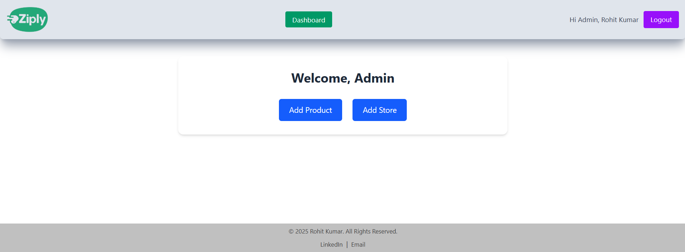
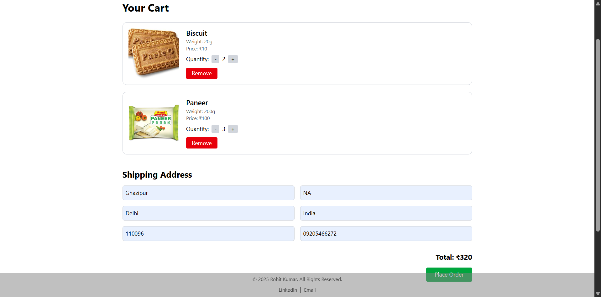

# 🚚 Ziply – Instant Delivery Platform  

## 📌 Overview  
**Ziply** is a **fast, location-aware delivery platform** designed to meet the growing demand for instant product delivery. By leveraging a network of **"Dark Stores"** placed every 7 km, Ziply ensures that customer orders are fulfilled by the **nearest available store**, drastically reducing delivery time.

Inspired by models like **Zepto** and **Blinkit**, Ziply integrates geolocation APIs, efficient routing via the Haversine formula, and a real-time store operator dashboard to streamline operations and improve customer satisfaction.

---

## 👥 User Roles  
- 🛒 **Customers** – Browse products, place orders, track delivery.  
- 🧑‍💼 **Store Operators** – Get assigned orders, update processing status.  
- 🛠 **Admins (Optional)** – Manage products, stores, and user roles.  

---

## ✨ Features  

### 🛍️ *Customer Experience*  
- 🖥️ **Product Browsing** – Explore all available products by category.  
- 🛒 **Cart & Checkout** – Add items, enter address, and place orders.  
- 📍 **Location Detection** – Converts delivery address to coordinates using OpenCage API.  

### 🏪 *Store Operator Portal*  
- 🚀 **Auto Order Assignment** – Orders automatically routed to the nearest store.  
- 📦 **Status Tracking** – Update order states: *Preparing*, *Packed*, *Dispatched*, *Delivered*.  
- 🔔 **Real-Time Alerts** – Operators notified instantly on order placement.  

### 📊 *Admin Dashboard (Optional)*  
- ➕ **Product & Store Management** – Add/remove stores and products.  
- 🗂️ **User Overview** – Monitor customer and operator activity.
 ### 🏠 Home Page  

  

---

## ⚙ Tech Stack  

### 🎯 **Frontend**
- **Framework** – React.js  
- **Styling** – Tailwind CSS  
- **Routing & State** – React Router, Context API  

### 🎯 **Backend**
- **Server** – Node.js + Express.js  
- **Database** – MongoDB + Mongoose  
- **Geolocation API** – OpenCage Geocoding API  
- **Distance Algorithm** – Haversine Formula  
- **Image Hosting** – Cloudinary  

---

## 🛠 Core API Routes  

### 👤 User API – `/api/v1/user`
- `POST /register` – Register user  
- `POST /login` – Login  
- `GET /profile` – Fetch user profile  

### 📦 Product API – `/api/v1/product`
- `GET /` – List products  
- `POST /add` – Add new product *(Admin only)*  
- `DELETE /:id` – Delete product *(Admin only)*  

### 🏬 Store API – `/api/v1/store`
- `GET /` – List stores  
- `POST /add` – Add a new store *(Admin only)*  

### 📬 Order API – `/api/v1/order`
- `POST /place` – Place an order *(Auto-routed to nearest store)*  
- `GET /store/:storeId` – Orders for a store  
- `PATCH /status/:orderId` – Update order status  

---

## 📍 Algorithm – Nearest Store via Haversine Formula  
1. Convert user's address to latitude & longitude using OpenCage.  
2. Fetch coordinates of all stores from MongoDB.  
3. Apply the Haversine formula to calculate distances.  
4. Assign the order to the store with the minimum distance.  

---

## 🖌 UI Highlights  

### 🏠 Home Page  

  

### 🛒 Cart Page  

  

### 📦 Store Operator Dashboard  

  

---

## 📅 Development Timeline  

| **Phase**         | **Week**      | **Activities**                                                                 |
|------------------|---------------|--------------------------------------------------------------------------------|
| 📐 Planning       | Week 1        | Define user flow, API planning, database schema design                        |
| 🧱 Core Setup     | Week 2–3      | Build user/product/order/store APIs, setup frontend routes & pages            |
| 🧭 Geo Features   | Week 4        | Integrate OpenCage API, implement Haversine logic                             |
| 🧪 Testing & UI   | Week 5        | Fix bugs, style with Tailwind CSS, implement operator dashboard               |
| 🚀 Final Launch   | Week 6        | Deploy backend & frontend, setup MongoDB Atlas, finalize documentation        |

---

## 📞 Contact  

For contributions, issues, or collaboration:  

📩 *Rohit Kumar* – [rohitraj42192@gmail.com](mailto:rohitraj42192@gmail.com)  

Let’s power the next-gen of instant delivery, one kilometer at a time! 🛵📦
